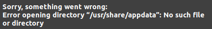

# Ubuntnu - Errors

## 1 | Erreur pour Ubuntu Software

Si vous obtenez ce problème :



Il faut d'abord fermé l'application.
Puis il suffit de le corriger par cette commande dans le terminal :

```
killall snap-store
```
