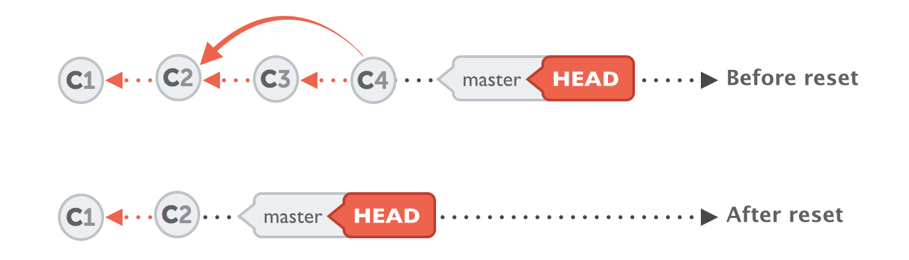

# Git | Configuration et utilisation

## 1 | Configuration

### 1 - Configuration de l'identification
Commande :
```
git config --global user.name "Your Name"
git config --global user.email "youremail@yourdomain.com"
```

### 2 - Vérification de la configuration d'identification
commande :
```
git config --list
```

Résultat :
```
user.name=ldumay
core.repositoryformatversion=0
core.filemode=true
core.bare=false>core.logallrefupdates=true
remote.origin.url=https://github.com/ldumay/2020-Linux-Apprentissage.git
remote.origin.fetch=+refs/heads/*:refs/remotes/origin/*
branch.main.remote=origin
branch.main.merge=refs/heads/main
```
## 2 | Utilisation

### 1 - Vérifier le statut du suivi git d'un projet

Avant chaque nouveaux commit, il faut vérifier le statut de l'intégrité d'un projet git via la commande ci-dessous :
```
git status
```

Cette commande à pour effet de nous afficher tous les fichiers et dossiers suivis et non suivis par le dépôt git rattaché, tel que :

```
Sur la branche main
Votre branche est à jour avec 'origin/main'.

Fichiers non suivis:
  (utilisez "git add <fichier>..." pour inclure dans ce qui sera validé)
        <dossier_non_suivi>/
        <dossier_non_suivi>/
        <fichier_non_suivi.txt>
        <fichier_non_suivi.jar>

aucune modification ajoutée à la validation mais des fichiers non suivis sont présents (utilisez "git add" pour les suivre)
```
NB : Notez que les fichiers ou dossiers révélés sont préciseés en rouge, notifiant leur exclusion au suivi git d'un projet.

### 2 - Ajouter le ou les nouveaux fichiers et dossiers au suivi git d'un projet

Pour ajouter des fichiers et dossiers au suivi git d'un projet, voici la commande a utilisé ci-dessous :
```
git add <votre_fichier_ou_dossier>
```

### 3 - Après l'ajout d'un ou de nouveaux fichiers et dossiers à un suivi git d'un projet

Une fois les fichiers et dossiers souhaités ajouté à un suivi git d'un projet, réeffectué la commande ci-dessous pour bien vérifier que tous vos ajouts ont bien été pris en compte par vos suivis.

```
git status
```

Bonus : Il est possible d'effectué lé commande ci-desous pour valider d'un seul coup tout les changements.

```
git add -A
```

Vous obtenez de nouveau ce résultat ci-dessous.

```
Sur la branche main
Votre branche est à jour avec 'origin/main'.

Fichiers non suivis:
  (utilisez "git add <fichier>..." pour inclure dans ce qui sera validé)
        <dossier_non_suivi>/
        <dossier_non_suivi>/
        <fichier_non_suivi.txt>
        <fichier_non_suivi.jar>

aucune modification ajoutée à la validation mais des fichiers non suivis sont présents (utilisez "git add" pour les suivre)
```
NB : Notez que, si tous les ajouts ont bien été validés, les fichiers ou dossiers révélés sont préciseés en vert, notifiant leur exclusion à un suivi git d'un projet. Dans le cas contraire, ces derniers réapparaitrons en vert.

### 4 - Soumettre vos nouveaux fichiers et dossiers à un suivi git d'un projet

Maintenant, il faut soumettre vos nouveaux fichiers et dossiers à un suivi git d'un projet. Pour ce faire, utiliser la commande ci-desous :

```
git commit -m "Votre Titre"
```

### 5 - Annuler le commit précédent non envoyer (->"undo commit")

Pour annuler le commit précédent qui n'a pas encore été envoyer, il y a cas principeaux à prendre en compte : en gardant ou retirant les modifications.

-> Annuler un commit en gardant les modifications qui ont été effectuées.

```
git reset --soft HEAD ~ 1
```

-> Annuler un commit en retirant les modifications qui ont été effectuées.

```
git reset --hard HEAD ~ 1
```

-> Annuler plusieurs commit en retirant les modifications qui ont été effectuées.



```
git reset --hard 0ad5a7a6
```

### 6 - Envoyer le tous à ce même suivi git d'un projet

Enfin, il suffit d'envoyer le tous à ce même suivi git d'un projet. La commande qui permet cela est celle-ci :

```
git push -u origin master
```

Bien sûr, il vous est demander de renseigner vos identifiants de laison à votre compte github.com, tel que :

```
Username for 'https://github.com': <votre_identifiant>
Password for 'https://<votre_identifiant_récupéré>@github.com' : <votre_mot_de_passe>
```

### 7 - Pour aller plus loin

=> [https://www.hostinger.fr/tutoriels/commandes-git](https://www.hostinger.fr/tutoriels/commandes-git)